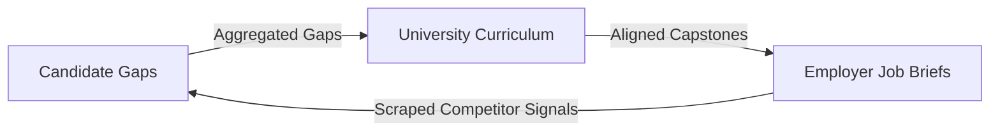

# Signal Path Career OS: Next Steps and Strategic Actions

**Prepared:** 22 June 2026  
**Context:** Technical roadmap and evaluation guidelines to prepare for the Tech Hackathon 2026 build phase.

---

## 1. Current Project Audit vs. Hackathon Criteria

The current visual design of Signal Path is highly polished, with three core modes (Individual, Enterprise, University) established. However, there are strategic gaps compared to the **Reference Build** and the **Final Kit** criteria that must be addressed to maximize your chances of winning:

| Hackathon Criterion / Guideline | Current Signal Path Implementation | Strategic Alignment Action Required |
| :--- | :--- | :--- |
| **"A working marketplace — at least one core flow end-to-end"** | All API queries are mock-intercepted in [demo-api.js](file:///Users/chris/Documents/Talent%20Bank/demo-api.js) returning hardcoded dummy data. | Deploy a live API backend (Node.js/Python) and hook up real API endpoints. |
| **"A lifelong model — follows a user from 15 to 65"** | Interaction is purely search-based (single query) without user profiles or long-term history. | Create a persistent candidate profile and interactive timeline tracking career transitions. |
| **"Career discovery — 12 Animals framework & trajectory map"** | Lacks career archetype mapping and long-term longitudinal path planning. | Implement a discovery questionnaire mapping profiles to archetypes and a visual trajectory map. |
| **Product & UX Thinking (30% Weight)** | Disjointed views (Individual, Enterprise, University act as separate tools). | Design a closed-loop system where data flows seamlessly between all three views. |

---

## 2. Phase 1: Pre-Build Infrastructure (Before June 29)

* [ ] **Early Deployment (Pitfall 03):** Deploy the static frontend ([index.html](file:///Users/chris/Documents/Talent%20Bank/index.html)) to Netlify, Vercel, or GitHub Pages immediately. Verify that Tailwind and Alpine.js assets render correctly.
* [ ] **Spin Up the API Backend:** Deploy a Node.js (Express) or Python (FastAPI) server on Render or Railway.
* [ ] **Clean Up Codebase:** Separate the API wrapper methods in [index.html](file:///Users/chris/Documents/Talent%20Bank/index.html) from the mock interception rules to allow switching between a `development` (mocked) and `production` (live) state.

---

## 3. Phase 2: Core Module Enhancements (June 29 - July 12)

### A. Individual Track

* [ ] **Live Data Integration:** Connect real search data pipelines (using Bright Data SERP or LinkedIn datasets) to dynamically populate job cards.
* [ ] **Dynamic AI Processing:** Integrate actual LLM APIs (OpenAI/Anthropic) to:
  * Parse uploaded CVs and extract skills.
  * Generate customized, contextual interview prep questions.
  * Draft tailored cover letters and resume summaries (Tailorman).
* [ ] **Interactive Trajectory Mapping:** Build a graphical timeline illustrating a 10–20 year progression path (e.g., *Junior Analyst -> Analytics Engineer -> Data Platform Lead*) showing experience barriers, skill requisites, and expected salary bands.

### B. Enterprise Track

* [ ] **Automated Competitor Indexing:** Hook up scrapers to scan live job listings of detected competitors.
* [ ] **Dynamic Urgency Calculation:** Program the backend to analyze competitor hiring velocity and return real competitive intelligence alerts (e.g., detecting what technologies they are scaling).

### C. University Track

* [ ] **Dynamic Syllabus Auditing:** Connect the curriculum textarea to the LLM to parse current syllabus topics, compare them to scraped market skill frequencies, and generate customized course actions.

---

## 4. Phase 3: Closed-Loop Network Integration (July 13 - July 20)

To create a **"Working Marketplace"** and wow the judges, connect the candidate, employer, and university datasets:

1. **Aggregated Gaps Feed:** Candidate skill deficits (e.g., `dbt`, `MLOps`) are logged by the system.
2. **University Alignment:** The University view dashboard reads these aggregated deficits and flags them as curriculum improvement recommendations.
3. **Aligned Capstones:** Universities output custom capstone projects based on these gaps, which feed directly back into the Employer's sourcing pipelines.

---

## 5. Phase 4: Final Polish & Submission (July 21 - July 26)

* [ ] **Micro-Animations:** Add visual state transitions and chart animations (ApexCharts) for a polished, responsive user experience.
* [ ] **2-3 Minute Walkthrough Video:** Focus on telling a cohesive product story (Candidate -> University -> Employer) rather than just clicking buttons.
* [ ] **Documentation:** Update the [Overview.md](file:///Users/chris/Documents/Talent%20Bank/Overview.md) to serve as your final documentation for the judges.

---

## 6. Codex Prompts by Phase

Use these pre-tailored prompts to direct Codex when refactoring your files:

### Phase 1: Pre-Build Infrastructure Prompts

#### Prompt 1.1: Refactoring frontend requests (index.html)
>
> **Context:** I have a single-page app in [index.html](file:///Users/chris/Documents/Talent%20Bank/index.html) that imports [demo-api.js](file:///Users/chris/Documents/Talent%20Bank/demo-api.js) to override `window.fetch`. I want to refactor the frontend fetch wrapper so that I can easily toggle between mocked local data and a live API server.
> **Task:** In [index.html](file:///Users/chris/Documents/Talent%20Bank/index.html) under the `<script>` tag where the fetch functions are located, define a global configuration constant `const USE_LOCAL_MOCKS = true;` (defaults to `true`). Refactor the custom fetch override function so that:
>
> 1. If `USE_LOCAL_MOCKS` is `true`, it delegates fetch requests to `window.__API_URL__` endpoints which are intercepted by `demo-api.js`.
> 2. If `USE_LOCAL_MOCKS` is `false`, it sets `API_BASE` to my live server URL (e.g., `https://signalpath-backend-service.onrender.com`) and carries out actual network `fetch` calls, adding standard authorization headers if `window.__APP_TOKEN__` is present.
> Preserve all existing Alpine.js state parameters and event-listener initializations.

#### Prompt 1.2: Bootstrapping the Backend Server
>
> **Context:** I need to build a backend API server that implements the exact endpoints mocked in [demo-api.js](file:///Users/chris/Documents/Talent%20Bank/demo-api.js).
> **Task:** Create a new Node.js Node-Express/FastAPI project. Inspect the `route` interceptor function in [demo-api.js](file:///Users/chris/Documents/Talent%20Bank/demo-api.js) and extract all endpoints:
>
> * `POST /api/search`
> * `POST /api/analyse`
> * `POST /api/company`
> * `POST /api/salary`
> * `POST /api/interview`
> * `POST /api/tailorman`
> * `POST /api/resume` (handles multipart resume files)
> * `GET /api/roadmap/:skill`
> * `POST /api/hr/detect-competitor`
> * `POST /api/hr/competitors`
> * `POST /api/hr/intelligence`
> * `POST /api/hr/recommendations`
> * `POST /api/hr/talent-hunt`
> * `POST /api/hr/outreach`
> Boot up a working Express/FastAPI server with CORS enabled, route definitions that match these, and stub responses mirroring the static payloads in [demo-api.js](file:///Users/chris/Documents/Talent%20Bank/demo-api.js). Use environment variables for the server port and API keys.

---

### Phase 2: Core Module Enhancement Prompts

#### Prompt 2.1: Integrating real job data & LLM parsing (Backend)
>
> **Context:** I want to replace the mock datasets in the backend with real LinkedIn job scrapes and LLM-driven intelligence.
> **Task:** In the backend server:
>
> 1. For `POST /api/search`, integrate a search API (e.g. SerpApi Google Jobs API or a web search client using Bright Data Web Unlocker) to fetch active listings matching the queried `role` and `location`.
> 2. For `POST /api/resume`, use an LLM API (OpenAI GPT-4o or Claude 3.5 Sonnet) to analyze the text content of the uploaded PDF/Word resume, identify key technical/soft skills, and infer the candidate's target role.
> 3. Ensure the endpoints return JSON matching the expected keys in our frontend Alpine.js controllers (`jobs`, `gaps`, `inferred_role`, etc.).

#### Prompt 2.2: Building the Career Trajectory Timeline (index.html)
>
> **Context:** The hackathon guidelines require a "lifelong model and trajectory map" (Pitfall 01/Reference Build).
> **Task:** In [index.html](file:///Users/chris/Documents/Talent%20Bank/index.html), inside the Individual results main panel, design a visual "Lifelong Career Trajectory Map" segment:
>
> 1. Use Alpine.js to dynamically bind a list of 5 progressive career milestones based on the searched role (e.g. for "Data Analyst", show: *Junior Data Analyst -> Data Analyst -> Senior Product Analyst -> Analytics Engineer -> Director of Data*).
> 2. For each milestone block, design a modern timeline node displaying: years of experience required, average salary range, top 2 skill gaps required to cross into this role, and a "risk rating" (Low, Medium, High).
> 3. Style it using Tailwind CSS matching our dark theme (canvas: `#060a12`, surface: `#0d1526`, border: `rgba(59,130,246,0.15)`) with hover zoom highlights.

---

### Phase 3: Closed-Loop Network Prompts

#### Prompt 3.1: Aggregating Gaps and Aligning University Curriculums (Full Stack)
>
> **Context:** I want to connect Candidate searches, Employer needs, and University syllabi in a closed loop.
> **Task:**
>
> 1. In the backend, set up a simple MongoDB database or SQLite schema to store user searches. When a Candidate searches for a job and reveals skill gaps, save these skills to a `gaps_ledger` database table.
> 2. Write a new backend endpoint `GET /api/uni/metrics` that queries this ledger, aggregates the top 5 most frequently occurring skill gaps in the market, and calculates a dynamic "Curriculum Readiness Benchmark".
> 3. In [index.html](file:///Users/chris/Documents/Talent%20Bank/index.html) inside the University flow (`activeTab === 'university'`), refactor the `runCurriculumScan` method. Instead of matching locally, fetch metrics from `GET /api/uni/metrics`. Dynamically compare the user's input curriculum text against these real-time aggregated candidate gaps, highlighting exactly which skills are "Missing" on the charts and dynamically tailoring the Capstone brief generator to focus on these aggregated gaps.

---

### Phase 4: Final Polish Prompts

#### Prompt 4.1: Enhancing UX and ApexCharts responsiveness
>
> **Context:** Product & UX carries 30% of the judging score. I want to optimize animations and ensure responsive design.
> **Task:**
>
> 1. In [index.html](file:///Users/chris/Documents/Talent%20Bank/index.html), review all UI transitions. Add loading spinners to the *Tailorman*, *Interview Prep*, and *Curriculum Engine* panels that trigger during network delays.
> 2. Review the `renderGapsChart` function. Configure the ApexCharts options to be responsive: adjust the chart height, font size of data labels, and padding of the y-axis labels on screens smaller than 768px to ensure the chart is fully legible on mobile devices.
> 3. Add smooth page loading transitions using GSAP and Alpine.js animations when switching between the Seeker, Enterprise, and University views.
